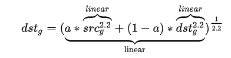

# PSLinearColorSpace
Change color space of Photoshop to linear.

## Import .csf File
Edit->Color Settings->Load

## linear.csf
Change color space to linear.

## linearBlend.csf
Only affect the blend equation.

